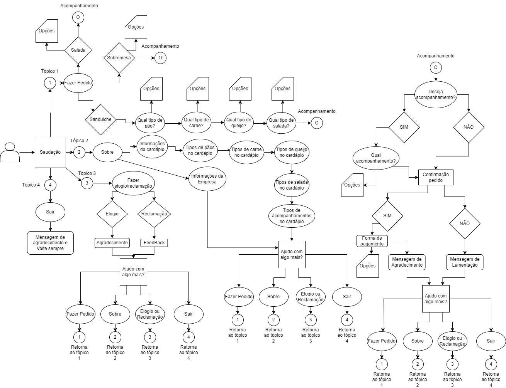

# :compass: Subway Bot

**Projeto 7 – PB Compass**

Semana 14 • ML AWS • Compass UOL • 2024

## :bookmark_tabs: Sumário
### [Sobre](#information_source-sobre-o-chatbot) •  [Características](#chart_with_upwards_trend-características) •  [Tecnologias](#gear-tecnologias) • [Setup](#rocket-setup) •
### [AWS arquitetura](#building_construction-aws-arquitetura) • [Estrutura do chatbot](#file_folder-estrutura-do-chatbot) • [Dificuldades](#construction-dificuldades) • [Desenvolvedores](#busts_in_silhouette-desenvolvedores)

## :information_source: Sobre o chatbot
Este projeto envolveu o desenvolvimento de um chatbot com base nas regras de negócio da rede de fast food Subway. Utilizamos o serviço Lex da AWS para implementar o sistema conforme as especificações da empresa mencionada anteriormente. A publicação inicial ocorreu por meio do aplicativo de mensageria Slack para testes.

O objetivo principal do chatbot é oferecer aos usuários um atendimento semelhante ao da loja física de forma remota e dinâmica. Os usuários podem selecionar o prato desejado, escolher acompanhamentos e até mesmo a forma de pagamento por meio da interação com o chatbot.

## :chart_with_upwards_trend: Características

### Fluxograma de interações
Fluxos de interação na aplicação:



### Cards Responsivos
Para otimizar o atendimento e evitar erros, o chatbot foi construído utilizando cards responsivos, permitindo que o usuário preencha todas as informações necessárias de forma interativa. Essa abordagem reduz os erros, acelera o atendimento e melhora a experiência do usuário ao apresentar opções em forma de botões.

[↑ De volta ao topo](#compass-subway-bot)

## :gear: Tecnologias


[↑ De volta ao topo](#compass-subway-bot)

## :rocket: Setup
Este guia fornece os passos necessários para acessar o bot Subway no Slack.
- Abra o aplicativo de mensagens Slack e faça login com suas credenciais.
- Utilize o seguinte link para ingressar na comunidade do Grupo-7 no Slack:
```
https://join.slack.com/t/grupo-7workspace/shared_invite/zt-2h1trcmm9-l7UYgctWY_V2abLv3JNfJw
```
- Após ingressar na comunidade, no menu à direita, vá para a aba "Apps" e acesse o bot Subway-Bot para iniciar a conversa.

### AWS Lex
Este guia fornece os passos necessários para importar o bot Subway no AWS Lex.

#### Passo 1: Baixar o Arquivo Subwaybot-LexJson.zip
- Baixe o arquivo Subwaybot-LexJson.zip localizado dentro da pasta src.

#### Passo 2: Acessar o AWS Console e Navegar até o Amazon Lex
- Acesse o console da AWS em console.aws.amazon.com.
- No menu de serviços, procure e selecione "Amazon Lex".

#### Passo 3: Importar o Bot Subway
- No painel lateral do Amazon Lex, clique em "Bots".
- Em seguida, clique em "Importar".
- Adicione um nome para o seu bot.
- Em "Arquivo de entrada", selecione o arquivo .zip que você baixou anteriormente (Subwaybot-LexJson.zip).
- Em "Permissões do IAM", selecione "Criar uma função com permissões básicas do Amazon Lex".
- Em "COPPA", selecione "Não".
- Por fim, no final da página, clique em "Importar".

Isso importará o bot Subway no Amazon Lex, permitindo que você configure e utilize o chatbot conforme necessário.

[↑ De volta ao topo](#compass-subway-bot)

## :building_construction: AWS Arquitetura


[↑ De volta ao topo](#compass-subway-bot)

## :file_folder: Estrutura do chatbot

Intents
- saladaintent
- saudacaointent
- sobreintent
- feedbackintent
- comoPossoAjudar
- verificaAcomp
- pagamento
- acompanhamento
- sanduicheintent

slots
- pao
- queijo
- bebidas
- sobremesas
- salgados
- sobreslot
- feedbackText
- vegetais
- verificacao
- carne

[↑ De volta ao topo](#compass-subway-bot)

## :construction: Dificuldades

O grupo enfrentou dificuldades ao implementar a confirmação final do pedido com a lista completa de produtos. Além disso, também encontramos desafios de acessibilidade no console da AWS, uma vez que o leitor de tela apresenta dificuldades na leitura da maioria das opções, o que complicou a criação de Intents e a implementação de cards responsivos.

[↑ De volta ao topo](#compass-subway-bot)

## :busts_in_silhouette: Desenvolvedores
- Bernardo Tomasi
- Pablo Ernesto
- Rafael Neves
- Roger Lasch

[↑ De volta ao topo](#compass-subway-bot)
